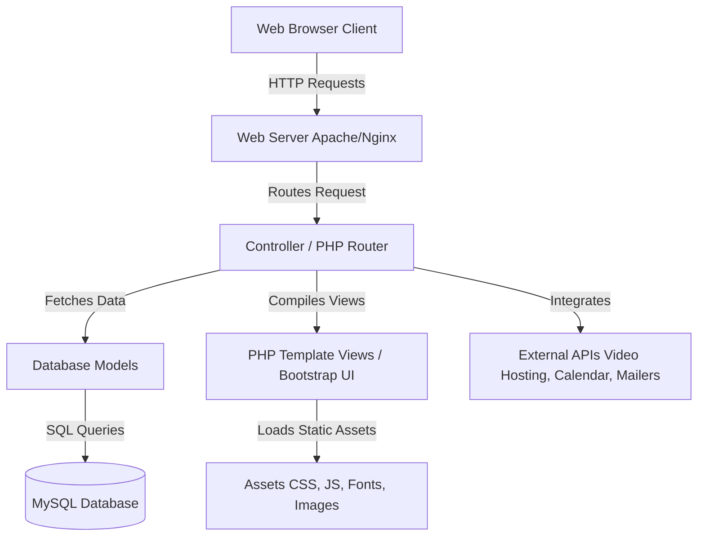
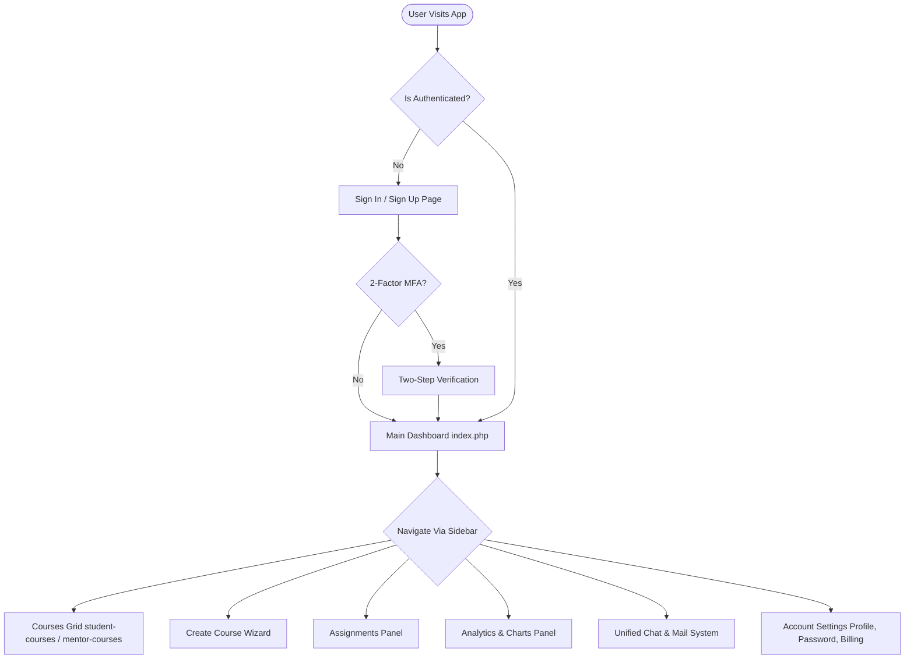
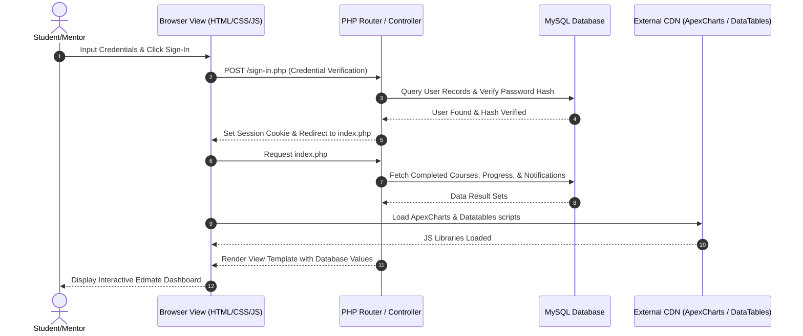
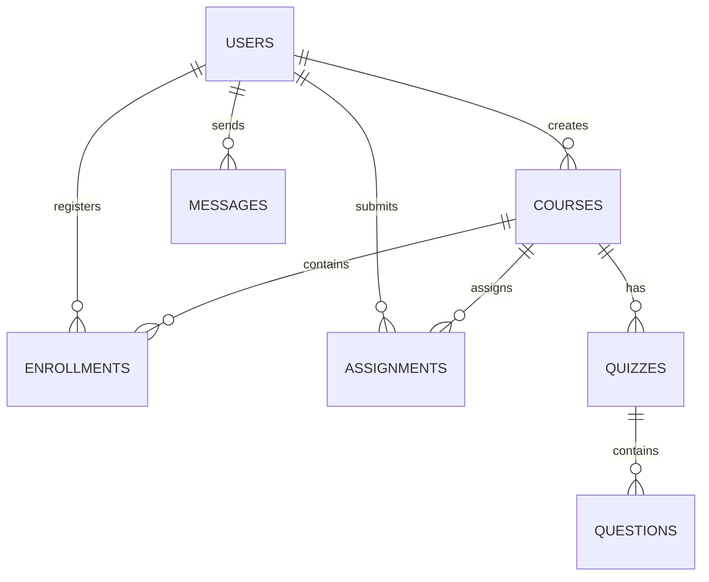
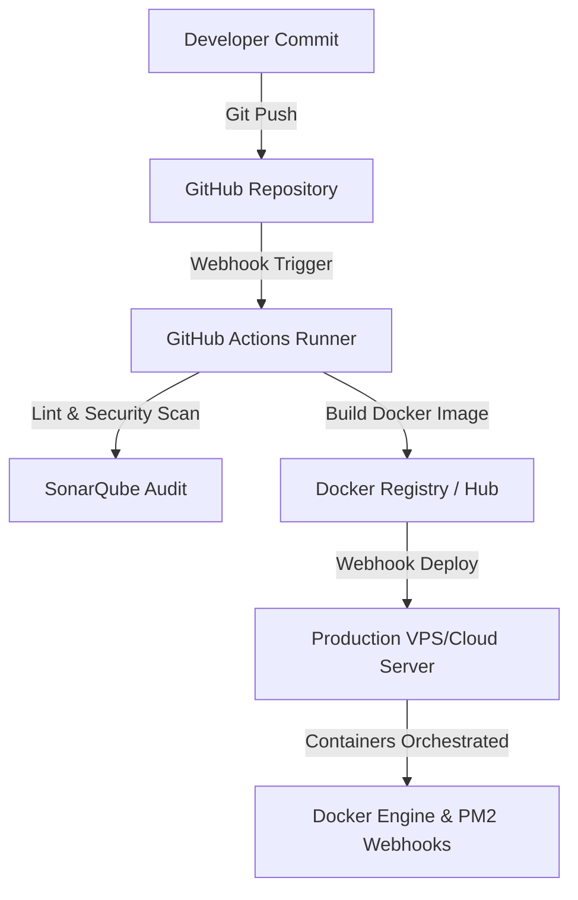

# 🎓 Edmate Learning Management System (LMS) Dashboard Portal

[](https://www.php.net/)
[](https://getbootstrap.com/)
[](https://jquery.com/)
[](https://opensource.org/licenses/MIT)

Edmate is an enterprise-grade, responsive, and visually stunning Learning Management System (LMS) dashboard portal. It is designed to cater to modern academic organizations, online instructors (mentors), and students. With rich, interactive UI components, complex dashboard layouts, and dedicated workflow panels, Edmate offers a seamless educational experience from enrollment to certification.

---

## 📖 Overview

### The Problem
Traditional educational portals are often rigid, visually dated, and structurally disjointed. Administrators, instructors, and students struggle to navigate between course planning, live classes, grading, interactive quizzes, calendar events, and direct messaging. These issues lead to low student engagement and high operational overhead.

### The Edmate Solution
Edmate solves these issues by providing a unified, client-side dashboard template that organizes all facets of online learning into a clean, modern, and lightning-fast portal. By integrating high-fidelity charting libraries, interactive calendars, full-featured media players, rich text editors, and instant messaging widgets, Edmate provides a unified hub for the modern virtual school.

### Business Value
* **Higher Retention:** A visually engaging interface leads to a more enjoyable student learning experience.
* **Instructor Efficiency:** Reduces course setup time with step-by-step course and quiz wizards.
* **Turnkey Integration:** High-quality PHP-ready pages simplify backend integration (Laravel, Symfony, or raw PHP + MySQL).

---

## 🧠 System Architecture

Edmate is designed to operate on a standard MVC/Layered web stack (LAMP/LEMP). The client-side relies on HTML5, CSS3, Bootstrap 5, and jQuery to load interactive components, while the pages are served as `.php` templates ready for backend logic compilation.

### 📊 Architecture Diagram



### 🏗️ Request Lifecycle & Design Decisions
1. **Request Ingestion:** The client requests a module (e.g., `analytics.php` or `student-courses.php`).
2. **Session & Security Validation:** The backend router executes middleware checking user authorization, CSRF headers, and active session tokens.
3. **Data Hydration:** PHP models pull stats, course directories, or message histories from the SQL database.
4. **Interactive Compilation:** The browser receives HTML markup and downloads static assets (jQuery, ApexCharts, FullCalendar, DataTables, Plyr).
5. **Interactive Render:** jQuery initializes the ApexCharts and Datatables objects with hydrated JSON data payloads, rendering client-side UI dashboards.

---

## 🔄 Application Flow

### 📌 User Flowchart



---

## 🔁 Sequence Diagram

The diagram below details the sequence of a student signing in and accessing their analytics dashboard.



---

## 🧩 Module Breakdown

Edmate's functional coverage is split into several interconnected modules:

### 1. Authentication & Security
* **Access Control:** Includes entry screens for User Register (`sign-up.php`), Login (`sign-in.php`), Password recovery (`forgot-password.php`, `reset-password.php`), and verification flows (`verify-email.php`).
* **Two-Step Verification:** Dedicated Multi-Factor PIN verification interface (`two-step-verification.php`) ready to integrate with SMS gateways or authenticator apps.

### 2. Admin & Mentor Dashboard
* **Index Configurations:** Three distinct visual styles for dashboard landing pages (`index.php`, `index-2.php`, `index-3.php`), each tailored for different user perspectives (Admin, Mentor, and Student) showcasing quick KPI panels and course recommendations.
* **Interactive Statistics:** Live ApexCharts showing total watch time, test passing rates, and study tracking statistics.

### 3. Course Management & Creation Wizard
* **Interactive Course Builder:** Step-by-step wizard to create courses (`create-course.php`), upload educational videos (`upload-videos.php`), build custom student evaluation quizzes (`create-quiz.php`), and complete a final check before deployment (`publish-course.php`).
* **Detailed Analytics:** Course analytics (`analytics.php`) displaying total student enrollment, completion progress, and individual performance feedback.

### 4. Student Portals & Academics
* **Course Hub:** Grid and list displays representing courses in progress (`student-courses.php`, `mentor-courses.php`), with item filtering by status (completed, draft, active) and tags.
* **Media Player Integrations:** Rich HTML5 video player integration (`course-details.php`) using `plyr.js` to track watch progress and access resource attachments (`resources.php`).
* **Assignments System:** Assignment dashboard (`assignment.php`) with due dates, description fields, status alerts, and dropzone components.

### 5. Social & Communication Tools
* **Unified Messaging:** A dual-purpose system providing a webmail client layout (`email.php`) for asynchronous updates and an instant chat interface (`message.php`) with search, filter, star, and inline replies.
* **Global Scheduling:** FullCalendar widget scheduling hub (`event.php`) that maps assignments, project submissions, library holds, and virtual meetings.

---

## 🧰 Tech Stack (Beginner → Expert)

### Frontend Framework & Styling
* **Bootstrap v5.3:** Responsive utility-first grid framework. Used for all layout positioning, modals, tabs, dropdowns, and responsiveness.
* **Vanilla CSS (Main Style):** Located in `assets/css/main.css`. Implements a premium color palette (using HSL CSS variables for light/dark mode states), animations, typography, and card UI design.
* **Phosphor Icons:** Scalable web icon set used throughout the dashboard sidebar, navigation buttons, and labels.

### Rich Javascript Plugins
* **jQuery v3.7.1:** The foundational scripting library used to bind elements, toggle sidebar states, handle modals, and execute AJAX calls.
* **ApexCharts:** Custom data visualization engine rendering line graphs, dual-axis radial bars, area charts, and performance grids in SVG format.
* **FullCalendar:** Renders calendar schedulers, drag-and-drop events, and calendar lists natively.
* **DataTables:** Auto-injects sorting, fast searching, page pagination, and entries limitations on tabular grids (e.g. lists of students and mentors).
* **Quill Editor:** Rich text WYSIWYG editor integration on course and bio creation fields.
* **Plyr.js:** Fully customizable HTML5, YouTube, and Vimeo media player wrapper.
* **jQuery UI & jVectorMap:** Drag-and-drop elements, sliders, and interactive mapping systems.

---

## 📂 Project Structure (Optimized)

The codebase is currently structured with all UI files sitting flat in the root directory. Below, we showcase the current layout and an improved folder structure optimized for clean MVC segregation.

### 📋 Current Structure vs. 🚀 Recommended Production Structure

```
📁 Current Workspace Folder (Flat PHP Files)
└── f:\smart\3\123
    ├── index.php
    ├── index-2.php
    ├── ... (other 28 php files)
    └── veiw-details.php
```

To prepare for enterprise-level scale, the following file directory structure is recommended:

```
🚀 RECOMMENDED MVC STRUCTURE
├── 📁 public/                 # Exposed web root folder
│   ├── index.php             # Main entry point (router loader)
│   └── 📁 assets/            # Client static resources (moved from parent)
│       ├── 📁 css/           # CSS stylesheets (Bootstrap, main, plyr)
│       ├── 📁 js/            # Javascript plugins (ApexCharts, main, jquery)
│       └── 📁 images/        # UI icons, logos, flags, user images
├── 📁 config/                 # Application settings and DB linkages
│   └── db_connection.php     # MySQL database configs (PDO engine)
├── 📁 app/                    # Primary backend directory
│   ├── 📁 controllers/       # Handles incoming request logic & payloads
│   ├── 📁 models/            # Performs direct SQL queries to database
│   └── 📁 views/             # Split PHP views for DRY structure
│       ├── 📁 includes/      # Reusable templates (header, sidebar, footer)
│       ├── 📁 student/       # Student specific dashboards & views
│       ├── 📁 mentor/        # Course management & builder dashboards
│       └── 📁 auth/          # Authentication templates
├── 📁 uploads/                # User video, avatar, and assignment storage
├── composer.json              # Backend dependencies (PHPMailer, etc.)
└── package.json               # Frontend dependencies manager (npm run dev)
```

---

## ⚙️ Installation & Setup

Edmate can be run using a local PHP environment or containerized using Docker.

### 🖥️ System Requirements
* **PHP:** v8.1 or higher (with PDO-MySQL, Mbstring, and JSON extensions enabled).
* **Web Server:** Apache (mod_rewrite enabled) or Nginx.
* **Database:** MySQL v8.0 or MariaDB v10.4.
* **Dependency Manager:** Node.js (for asset compilation) & Composer (for backend tools).

### 🔧 Step-by-Step Local Setup

1. **Clone the Repository:**
   ```bash
   git clone https://github.com/your-username/edmate-lms.git
   cd edmate-lms
   ```

2. **Integrate Static Assets:**
   Ensure that the `assets` folder (currently in the parent directory) is copied directly into your project's root folder:
   ```bash
   # Windows (Command Prompt)
   xcopy /E /I ..\assets assets
   
   # Linux / macOS
   cp -r ../assets assets
   ```

3. **Configure Environment Variables:**
   Create a `.env` file in the root of the project to set up variables:
   ```env
   # Application Settings
   APP_ENV=development
   APP_DEBUG=true
   APP_URL=http://localhost:8000

   # Database Linkage
   DB_HOST=127.0.0.1
   DB_PORT=3306
   DB_NAME=edmate_db
   DB_USER=root
   DB_PASS=secret_password
   
   # SMTP Credentials for verify-email.php
   SMTP_HOST=smtp.mailtrap.io
   SMTP_PORT=2525
   SMTP_USER=your_smtp_user
   SMTP_PASS=your_smtp_pass
   ```

4. **Initialize MySQL Database:**
   Import the following starter table schemas into your local database tool (e.g. phpMyAdmin):
   ```sql
   CREATE DATABASE IF NOT EXISTS edmate_db;
   USE edmate_db;

   -- User Accounts Table
   CREATE TABLE users (
       id INT AUTO_INCREMENT PRIMARY KEY,
       first_name VARCHAR(100) NOT NULL,
       last_name VARCHAR(100) NOT NULL,
       email VARCHAR(150) UNIQUE NOT NULL,
       phone VARCHAR(50),
       password_hash VARCHAR(255) NOT NULL,
       role ENUM('admin', 'mentor', 'student') DEFAULT 'student',
       zip_code VARCHAR(20),
       bio TEXT,
       avatar VARCHAR(255) DEFAULT 'assets/images/thumbs/user-img.png',
       mfa_secret VARCHAR(100) NULL,
       mfa_enabled TINYINT(1) DEFAULT 0,
       created_at TIMESTAMP DEFAULT CURRENT_TIMESTAMP
   );
   ```

5. **Start Local Development Server:**
   You can serve the application instantly using PHP's built-in CLI server:
   ```bash
   php -S localhost:8000
   ```
   Open `http://localhost:8000/index.php` in your browser.

---

### 🐳 Docker & Docker Compose Setup

For a containerized setup, create a `docker-compose.yml` and `Dockerfile` in the root:

**`Dockerfile`**
```dockerfile
FROM php:8.2-apache
RUN docker-php-ext-install pdo pdo_mysql
RUN a2enmod rewrite
COPY . /var/www/html/
RUN chown -R www-data:www-data /var/www/html
```

**`docker-compose.yml`**
```yaml
version: '3.8'
services:
  web:
    build: .
    ports:
      - "8000:80"
    volumes:
      - .:/var/www/html
    environment:
      - DB_HOST=db
    depends_on:
      - db
  db:
    image: mysql:8.0
    command: --default-authentication-plugin=mysql_native_password
    restart: always
    environment:
      MYSQL_DATABASE: edmate_db
      MYSQL_ROOT_PASSWORD: secret_password
    ports:
      - "3306:3306"
```
Run `docker-compose up --build -d` to compile and run the local environment.

---

## 🔐 Security & Restrictions

An enterprise LMS requires strict security controls to manage student grading and prevent cheating during evaluation steps.

### 🛡️ Recommended Security Enhancements
1. **Password Hashing:** Ensure password encryption using `password_hash()` with `PASSWORD_BCRYPT` in `sign-up.php`.
2. **Access Control (RBAC):** Check session credentials at the top of each script to prevent student access to instructor views:
   ```php
   // Place in top of mentor-courses.php / create-course.php
   session_start();
   if (!isset($_SESSION['user_id']) || $_SESSION['role'] !== 'mentor') {
       header("Location: sign-in.php");
       exit();
   }
   ```
3. **Cross-Site Scripting (XSS) Mitigation:** Escape outputs generated from database variables (e.g. names, user bios) using `htmlspecialchars($data, ENT_QUOTES, 'UTF-8')`.

### 🚫 Anti-Cheat Security Controls (For Exam & Quiz Panels)
To secure quiz sessions (`create-quiz.php`), the following JavaScript snippets prevent navigation, external research, and copy-pasting during examination sessions:

```javascript
// Add to quiz window listener
document.addEventListener('contextmenu', event => event.preventDefault()); // Blocks Right Click

document.addEventListener('keydown', event => {
    // Blocks F12, Ctrl+Shift+I, Ctrl+C, Ctrl+V, Ctrl+U
    if (event.keyCode === 123 || 
        (event.ctrlKey && event.shiftKey && event.keyCode === 73) || 
        (event.ctrlKey && (event.keyCode === 67 || event.keyCode === 86 || event.keyCode === 85))) {
        event.preventDefault();
        alert("Action restricted during quiz session.");
    }
});

// Detects Tab Switch and auto-submits exam
let tabSwitchCount = 0;
document.addEventListener("visibilitychange", () => {
    if (document.hidden) {
        tabSwitchCount++;
        alert(`Warning! Tab switch detected (${tabSwitchCount}/3). Exceeding limit will auto-submit.`);
        if (tabSwitchCount >= 3) {
            autoSubmitQuiz();
        }
    }
});
```

---

## 📡 API Design

For database operations, the portal relies on JSON payloads exchanged with the backend.

### Sample Endpoint Catalog

#### 1. Retrieve Student Course Catalog
* **Endpoint:** `GET /api/courses.php?student_id={id}`
* **Payload Format:** JSON
* **Response Example:**
  ```json
  {
    "status": "success",
    "total_courses": 2,
    "courses": [
      {
        "id": 101,
        "title": "Full Stack Web Development",
        "lessons": 24,
        "hours": 40,
        "progress_percent": 75,
        "status": "active"
      }
    ]
  }
  ```

#### 2. Create Evaluation Quiz
* **Endpoint:** `POST /api/quizzes.php`
* **Payload Format:** JSON
* **Request Example:**
  ```json
  {
    "course_id": 101,
    "quiz_title": "PHP Basics Quiz",
    "time_limit_mins": 30,
    "questions": [
      {
        "question": "What does PHP stand for?",
        "options": ["Hypertext Preprocessor", "Personal Home Page", "Private HTML Page"],
        "answer": 0
      }
    ]
  }
  ```

---

## 🗄️ Database Design

The schema below details the core tables and relationships required to back the Edmate user roles, courses, assignments, quizzes, and live classes.

### 📊 Entity-Relationship (ER) Diagram



### 🧾 Database Fields & Indexing Strategy
* **`users` Table:** Primary Key (`id`), Unique index on `email` to speed up sign-in lookup.
* **`courses` Table:** Primary Key (`id`), Foreign Key (`mentor_id`) references `users(id)`. Indexed on `status` to filter active courses.
* **`enrollments` Table:** Compound Index (`student_id`, `course_id`) ensuring unique enrollments and enabling rapid progress updates.
* **`messages` Table:** Indexed on (`sender_id`, `receiver_id`) to optimize messaging history fetch queries.

---

## 🚀 DevOps & Deployment

Deploying the portal to production involves automation, Docker containerization, and automated CI/CD pipeline routing.

### ⚙️ Deployment Diagram



### ⚙️ CI/CD Workflow Setup
1. **GitHub Actions Workflow:** Configured in `.github/workflows/deploy.yml`. Toggles automated testing, code quality scans, and linter checks on PHP files.
2. **Auto-Deployment Hook:** In production, a webhook listener pulls the latest commits, stops the active container, copies the updated PHP templates, and restarts the environment using:
   ```bash
   docker-compose down
   docker-compose up --build -d
   ```

---

## 🧹 Project Optimization Report

A deep code audit of the current flat workspace highlighted several items that must be resolved prior to production launch:

| Issue Detected | Category | Description / Impact | Recommendation |
| :--- | :--- | :--- | :--- |
| **Missing Assets** | **Pathing / Structure** | All templates request styles/scripts from `assets/...`, but the directory is in the parent path `../assets`. All styling and scripts fail to load. | Copy/move the `assets` folder into the `123/` root directory, or update file paths to relative parent notation `../assets/...`. |
| **Dead HTML Links** | **Navigation Broken** | Links in pages point to static `.html` files (e.g. `<a href="index.html">`), but files in workspace are `.php`. Clicking links causes 404 errors. | Run a search-and-replace command across all PHP files to change `.html` references to `.php`. |
| **Code Redundancy** | **DRY Violations** | The complete page layout header, sidebar panel, and footer templates are duplicated inside all 31 PHP files. Changes require editing 31 files. | Extract layout wrappers into an `includes/` folder (`header.php`, `sidebar.php`, `footer.php`) and load them dynamically using `include()` functions. |
| **Typo in File Name** | **Maintenance** | Page `veiw-details.php` contains a spelling error. Leads to confusion and bad pathing structures. | Rename the file to `view-details.php` and update references across all files. |
| **Lack of Security Verification** | **Security Risk** | Standard templates do not check session variables, validate user roles, or include CSRF check tokens in action fields. | Inject session check validation headers at the top of each dashboard view page and require token verifications on forms. |

---

## 🤝 Contribution Guide

We welcome contributions to optimize Edmate:
1. Fork the project.
2. Create your Feature Branch: `git checkout -b feature/CoolLMSFeature`.
3. Commit your changes: `git commit -m 'Add some CoolLMSFeature'`.
4. Push to the branch: `git push origin feature/CoolLMSFeature`.
5. Open a Pull Request detailing changes and visual updates.

---

## 📜 License

Distributed under the MIT License. See [LICENSE](LICENSE) for more information.
